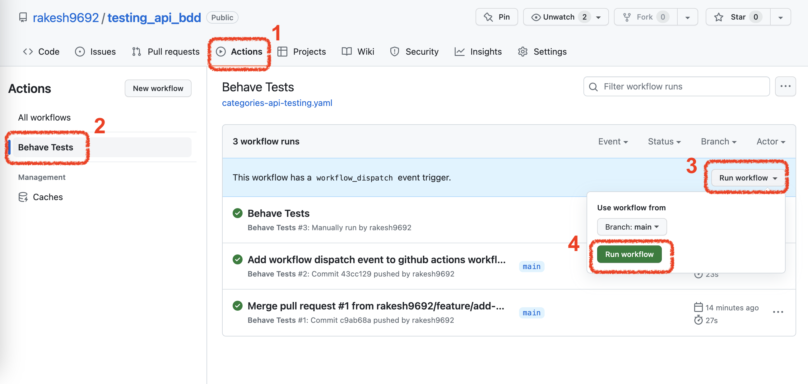
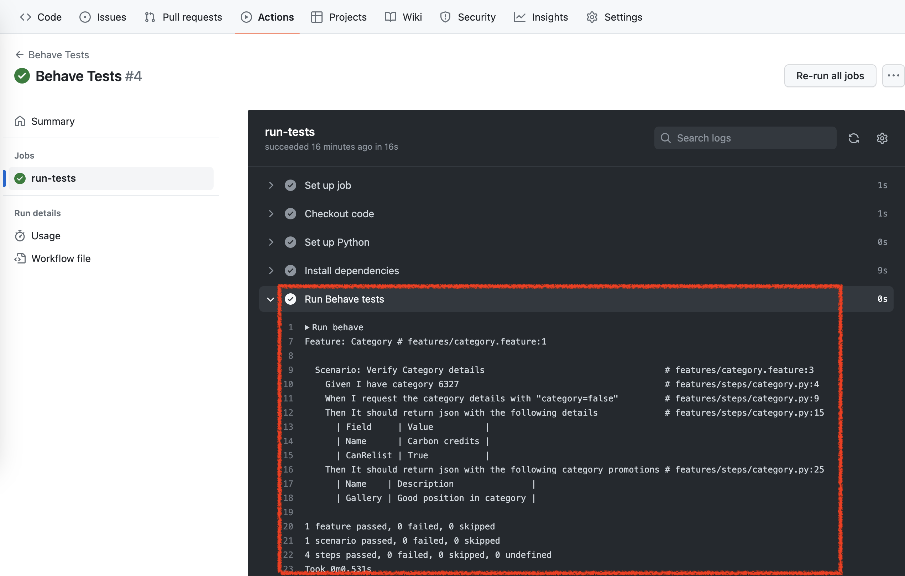

# Category API Testing

This repository contains code for testing the Category API using the Behave framework. The Category API allows users to retrieve and verify category details and promotions.

## Prerequisites

- Python 3.x
- pip

## Run tests via Github Actions
- Tests can be run without setting up the project locally by running [github action workflow](https://github.com/rakesh9692/testing_api_bdd/actions/workflows/categories-api-testing.yaml) as shown below:


- Here is an example of a test run via github actions:




## Setup locally

1. Clone the repository:

   ```bash
   git clone https://github.com/your-username/category-api-testing.git
   ```
2. Change into the project directory:
   ```bash
   cd category-api-testing
   ```
3. Install the required dependencies:
   ```bash
    pip install -r requirements.txt
   ```
4. Set up the environment variables:
  ```bash
  export BASE_URI=$API_BASE_URI
  ```
Note: If the BASE_URI environment variable is not set, the default value https://api.tmsandbox.co.nz will be used.

## Running the Tests
To run the tests, execute the following command from the repo's root dir:
```bash
behave
```
This command will run all the test scenarios defined in the category.feature file and generate a report displaying the test results.


## Customizing the Tests

The behavior-driven tests are defined in the category.feature file, and the corresponding step implementations are in the category.py file.

  1. To modify the test scenarios, update (or add more feature files) the feature file (features/category.feature) with the desired scenarios and assertions.
  2. To modify the step implementations, update the step file (features/steps/category.py) with the necessary code changes.
